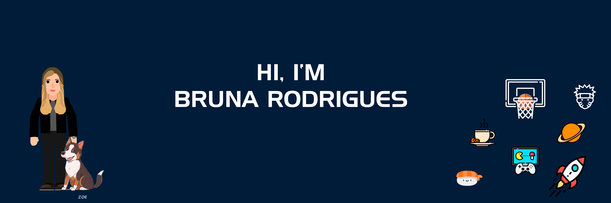

Hey there 👋

I’m Bruna, a student from ESPM and full-stack developer, creative coder and I'm interested in designer who specializes in front-end development. 

- 🔭 I’m currently working on Khipo
- 🌱 I’m currently learning React and React Native
- 📚 Academic: I was a student of scientific initiation
- 📫 How to reach me: brunakjrodrigues@gmail.com
- ⚡ Fun fact: I Like to play Valorant, I love dogs and I have passion for music

## &#x1f4c8; GitHub Stats

 

 
 

## 💼 Skills

<code></code>
<code></code>
<code></code>
<code></code>
<code></code>
<code></code>
<code></code>
